# LAPORAN PRAKTIKUM
### Praktikum: Review Konsep Dasar OOP Menggunakan Java
## Mata Kuliah: Design Pattern

| | |
|---|---|
| **Nama** | Nazril Kanahaya Akbar |
| **NIM** | 2024573010105 |
| **Kelas** | TI 2A |
| **Mata Kuliah** | Design Pattern |

---

# BAB I
# PENDAHULUAN

## 1.1 Latar Belakang

Pemrograman berorientasi objek (Object-Oriented Programming/OOP) merupakan paradigma pemrograman yang menjadi fondasi utama dalam pengembangan perangkat lunak modern. Dalam OOP, program dibangun dari kumpulan objek yang saling berinteraksi, sehingga kode menjadi lebih terstruktur, modular, dan mudah dikembangkan. Java merupakan salah satu bahasa pemrograman yang sepenuhnya mendukung konsep OOP dan banyak digunakan dalam dunia industri maupun pendidikan.
Untuk membangun pemahaman yang kuat terhadap OOP, diperlukan penguasaan terhadap konsep-konsep dasarnya, seperti class dan object, atribut dan method, access modifier, getter dan setter, serta constructor. Konsep-konsep tersebut menjadi dasar sebelum mempelajari materi yang lebih lanjut seperti Design Pattern.
Oleh karena itu, praktikum ini dilakukan untuk memberikan pemahaman secara langsung melalui implementasi kode program, sehingga mahasiswa dapat memahami cara kerja OOP secara nyata dan mampu menerapkannya dalam pembuatan program yang terstruktur.


## 1.2 Tujuan Praktikum

1. Memahami konsep dasar class dan object dalam pemrograman Java.
2. Mampu mendefinisikan atribut dan method di dalam sebuah class.
3. Memahami dan menerapkan access modifier (`public`, `private`, `protected`, `default`) pada atribut dan method.
4. Mampu menggunakan getter dan setter sebagai bagian dari konsep encapsulation.
5. Memahami dan mengimplementasikan constructor, baik default constructor, parameterized constructor, maupun constructor overloading.
6. Mampu membangun program sederhana berbasis OOP dengan menggabungkan seluruh konsep yang telah dipelajari.

---

# BAB II
# PRAKTIKUM DAN LATIHAN

## 2.1 Bagian 1 — Class and Object

### 2.1.1 Langkah Praktikum

1. Buka kembali project dari praktikum sebelumnya menggunakan IntelliJ IDEA.
2. Tambahkan sebuah package baru di dalam folder `src` dengan cara klik kanan pada folder tersebut, lalu pilih `New -> Package`. Beri nama package tersebut `modul_2`.
3. Di dalam package `modul_2`, buat lagi sebuah package baru dengan cara yang sama (klik kanan, pilih `New -> Package`). Beri nama `bagian_1`.
4. Selanjutnya, buat sebuah class baru dengan nama `Mahasiswa` dan isi dengan kode berikut.

**Program:**

```java
package Praktikum_2.Bagian_1;

public class Mahasiswa {
    int umur;
    String nama;
}
```

5. Buat sebuah class baru dengan nama `Main`. dan isikan kode di bawah ini:

```java
package Praktikum_2.Bagian_1;

public class Main {
    public static  void main (String[] args) {
        //Membuat objek dari class Mahasiswa
        Mahasiswa mhs1 = new Mahasiswa();

        //Mengisi niai atribut
        mhs1.nama = "Nazril";
        mhs1.umur = 20;

        //Menampilkan nilai atribut
        System.out.println("Nama: " + mhs1.nama);
        System.out.println("Nama: " + mhs1.umur);
    }

}

```

**Output:** <br>

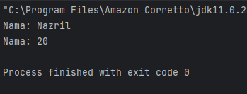

---

**Program:**

`buku.java`

```java
package Praktikum_3.bagian_1.Latihan;

public class buku {
    // Atribut
    String judul;
    String penulis;
    int TahunTerbit;

    void DisplayInfo() {
        System.out.println("Judul:" + judul);
        System.out.println("Penulis:" + penulis);
        System.out.println("TahunTerbit:" + TahunTerbit);
    }
}
```

`main.java`

```java
package Praktikum_3.bagian_1.Latihan;

public class main {
    public static void main(String[] args) {
        // Membuat object
        buku detail1 = new buku();
        detail1.judul = "Children of Dune";
        detail1.penulis = "Frank Herbert";
        detail1.TahunTerbit = 1976;

        detail1.DisplayInfo();
    }
}
```
**Output:** <br>


## 2.1.2 Latihan

1. Buatlah class Buku dengan atribut judul dan pengarang.
2. Buat object dari class Buku dan isi nilai atributnya.
3. Tampilkan nilai atribut tersebut.

---
**Program:**

`buku`

```java
package Praktikum_2.Bagian_1.Latihan;

public class Buku {
    String judul;
    String pengarang;

}

```

`main.java`

```java
package Praktikum_2.Bagian_1.Latihan;

public class Main {
    public static void main(String[] args) {

        // Membuat objek dari class Buku
        Buku buku1 = new Buku();

        // Mengisi nilai atribut
        buku1.judul = "Laskar Pelangi";
        buku1.pengarang = "Andrea Hirata";

        // Menampilkan nilai atribut
        System.out.println("Judul: " + buku1.judul);
        System.out.println("Pengarang: " + buku1.pengarang);
    }


}

```

**Output:**

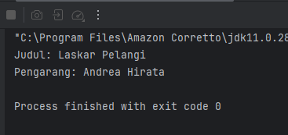

---

## 2.2 Bagian 2 — Atribute dan Method

### 2.2.1 Langkah Praktikum

1. Buat kembali sebuah package baru di dalam package `Praktikum_2` dengan cara klik kanan, kemudian pilih **New → Package**, lalu beri nama **bagian_2**.

2. Selanjutnya, buat sebuah class baru dengan nama **Kalkulator**, kemudian isi class tersebut dengan kode yang telah disediakan.

**Program:**

```java
package Praktikum_2.bagian_2;

public class Kalkulator {
    //Atribute
    int angka1;
    int angka2;

    //Method
    int tambah(){
        return  angka1 + angka2;
    }
}

```

3. Kemudian buat class baru dengan nama `main` di file `main.java`.

```java
    package Praktikum_2.bagian_2;

public class Main {
    public static void  main (String[] args) {
        Kalkulator kalkulator = new Kalkulator();
        kalkulator.angka1 = 10;
        kalkulator.angka2 = 20;

        System.out.println("Hasil penjumblahan " + kalkulator.tambah());
    }
}

```

**Output:**

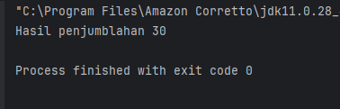

---

### 2.2.2 Latihan

1. Buat class Lingkaran dengan atribut jariJari.
2. Tambahkan method hitungLuas() yang mengembalikan nilai luas lingkaran.
3. Buat object dari class Lingkaran dan panggil method hitungLuas().

**Program:**

`Lingkaran`

```java
package Praktikum_2.bagian_2.Latihan;

public class Lingkaran {
    // Atribut
    double jariJari;

    // Method untuk menghitung luas
    double hitungLuas() {
        return Math.PI * jariJari * jariJari;
    }
}

```

`main.java`

```java
package Praktikum_2.bagian_2.Latihan;

public class Main {
    public static void main(String[] args) {

        // Membuat objek Lingkaran
        Lingkaran lingkaran = new Lingkaran();

        // Mengisi nilai atribut
        lingkaran.jariJari = 7;

        // Memanggil method dan menampilkan hasil
        System.out.println("Luas Lingkaran: " + lingkaran.hitungLuas());
    }
}

```

**Output:**

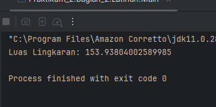

---

## 2.3 Bagian 3 — Akses Modifier

Dalam Java, setiap class, atribut, maupun method memiliki tingkat visibilitas yang diatur menggunakan **Access Modifier**. Terdapat empat jenis access modifier yang tersedia:

- **`public`** — Tidak ada batasan akses, dapat digunakan oleh class manapun di seluruh program.
- **`private`** — Akses paling ketat, hanya bisa digunakan di dalam class itu sendiri dan tidak bisa diakses dari luar.
- **`protected`** — Dapat diakses oleh class lain yang berada dalam package yang sama, serta oleh subclass meskipun berbeda package.
- **`default`** (tanpa keyword) — Apabila tidak dituliskan modifier apapun, maka akses hanya berlaku dalam satu package yang sama dan tidak bisa diakses dari luar package tersebut.

### 2.3.1 Langkah Praktikum

1. Buat kembali sebuah package baru di dalam package `Praktikum_3` dengan cara klik kanan, kemudian pilih **New → Package**, lalu beri nama **bagian_3**.

2. Selanjutnya, buat package baru di dalam package `bagian_3` dengan langkah yang sama, kemudian beri nama **AksesModifier**.

**Program:**

`AksesModifier.java`

```java
package Praktikum_2.bagian_3;

public class AksesModifier {
    public int publicVar = 1;
    private  int privateVar = 2;
    protected  int protectedVar = 3;
    int defaultVar = 4; //default

    public void tampilkan() {
        System.out.println("Public: " + publicVar);
        System.out.println("Private: " + privateVar);
        System.out.println("Protectred: " + protectedVar);
        System.out.println("Default: " + defaultVar);
    }
}

```

4. Kemudian buat sebuah class dengan nama `main` dan isikan kode berikut.

```java
package Praktikum_2.bagian_3;

public class Main {
    public static void main (String[] args){
        AksesModifier contoh = new AksesModifier();
        contoh.tampilkan();


    }
}

```

**Output:**

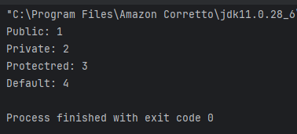

---

## 2.3.2 Latihan
1. Buat class AkunBank dengan atribut saldo (private) dan method tampilkanSaldo() (public).
2. Coba akses atribut saldo langsung dari luar class. Apa yang terjadi?

**Program:**

`AkunBank.java`

```java
package Praktikum_2.bagian_3.Latihan;

public class AkunBank {
    // atribut private
    private double saldo;

    // method untuk set saldo (biar bisa diisi dari luar)
    public void setSaldo(double saldo) {
        this.saldo = saldo;
    }

    // method untuk menampilkan saldo
    public void tampilkanSaldo() {
        System.out.println("Saldo: " + saldo);
    }
}

```

`main.java`

```java
package Praktikum_2.bagian_3.Latihan;

public class Main {
    public static void main(String[] args) {

        AkunBank akun = new AkunBank();

        // Mengisi saldo lewat method
        akun.setSaldo(1000000);

        // Menampilkan saldo
        akun.tampilkanSaldo();

        // Coba akses langsung (INI AKAN ERROR)
        // System.out.println(akun.saldo);
    }
}

```
**Output:**

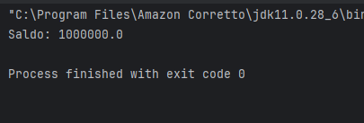

## 2.4 Bagian 4 — Setter dan Getter

Dalam OOP, **getter** dan **setter** adalah method yang digunakan untuk mengakses dan mengubah nilai atribut yang bersifat `private`.

- **Getter** — Method yang digunakan untuk **mengambil** nilai atribut dari luar class.
- **Setter** — Method yang digunakan untuk **mengubah** nilai atribut dari luar class.

Penggunaan getter dan setter merupakan bagian dari konsep **Encapsulation**, karena data disembunyikan dari akses langsung dan hanya bisa dimanipulasi melalui method yang telah disediakan.

### 2.4.1 Langkah Praktikum
1. Buat Sebuah package baru lagi didalam package modul_2 dengan cara klik kanan dan pilih New -> Package. Beri nama bagian_4
2. Kemudian buat sebuah class baru dengan nama Mobil dan isikan kode berikut:

**Program:**

`Mobil.java`

```java
package Praktikum_2.bagian_4;

public class Mobil {
    private  String merek;

    //setter
    public void setMerek(String merek) {
        this.merek = merek;
    }
    // getter
    public String getMerek(){
        return  merek;
    }
}

```

4. Buat class dengan nama `main`.

`main.java`

```java
package Praktikum_2.bagian_4;

public class Main {
    public static void main(String[] args){
        Mobil mobil = new Mobil();
        mobil.setMerek("Toyta");

        System.out.println("Merek Mobil" + mobil.getMerek());
    }
}

```
**Output:**

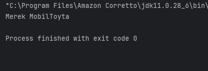


### 2.4.3 Latihan

1. Buat class Mahasiswa dengan atribut nama (private) dan nim (private).
2. Buat setter dan getter untuk kedua atribut tersebut.
3. Buat object dari class Mahasiswa dan gunakan setter untuk mengisi nilai atribut.

**Program:**

`Mahasiswa.java`

```java
package Praktikum_2.bagian_4.Latihan;

public class Mahasiswa {
    // atribut private
    private String nama;
    private String nim;

    // setter nama
    public void setNama(String nama) {
        this.nama = nama;
    }

    // getter nama
    public String getNama() {
        return nama;
    }

    // setter nim
    public void setNim(String nim) {
        this.nim = nim;
    }

    // getter nim
    public String getNim() {
        return nim;
    }
}
```
`main.java`

```java
package Praktikum_2.bagian_4.Latihan;

public class Main {
    public static void main(String[] args){

        // Membuat object Mahasiswa
        Mahasiswa mhs = new Mahasiswa();

        // Mengisi nilai pakai setter
        mhs.setNama("Nazril");
        mhs.setNim("2024573010105");

        // Menampilkan pakai getter
        System.out.println("Nama: " + mhs.getNama());
        System.out.println("NIM: " + mhs.getNim());
    }
}

```

**Output:**

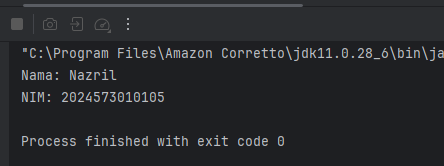

## 2.5 Bagian 5 — Constructor

Dalam OOP, **Constructor** adalah method khusus yang dipanggil secara otomatis pada saat sebuah objek dibuat dari suatu class. Constructor digunakan untuk menginisialisasi nilai awal atribut objek tersebut.

Terdapat tiga jenis constructor dalam Java:

- **Default Constructor** — Constructor yang tidak memiliki parameter. Nilai atribut akan diinisialisasi dengan nilai default secara otomatis.
- **Parameterized Constructor** — Constructor yang memiliki parameter, sehingga nilai atribut dapat langsung ditentukan pada saat objek dibuat.
- **Constructor Overloading** — Kondisi di mana sebuah class memiliki lebih dari satu constructor dengan jumlah atau tipe parameter yang berbeda, sehingga objek dapat dibuat dengan berbagai cara sesuai kebutuhan.

### 2.5.1 Langkah Praktikum

1. Buat Sebuah package baru lagi didalam package modul_2 dengan cara klik kanan dan pilih New -> Package. Beri nama bagian_5
2. Kemudian buat sebuah class baru dengan nama Person dan isikan kode berikut:

**Program:**

`Person.java`

```java
package Praktikum_2.bagian_5;

import java.security.PublicKey;

public class Person {
    private String nama;
    private int umur;

    //Default Constructor
    public Person(){
        nama = "Unknown";
        umur = 0;
    }

    //Parameterize Constructor
    public Person(String nama, int umur){
        this.nama = nama;
        this.umur = umur;
    }

    //method
    public void tampilkanInfo(){
        System.out.println("Nama: " + nama);
        System.out.println("Nama: " + umur);
    }
}

```

3. Kemudian buat class baru dengan nama `main` dan isikan kode berikut ini:

`main.java`

```java
package Praktikum_2.bagian_5;

public class Main {
    public  static  void main (String[] args){
        Person person1 = new Person();
        Person person2 = new Person("Nazril", 21);

        person1.tampilkanInfo();
        person2.tampilkanInfo();
    }
}

```

**Output:**

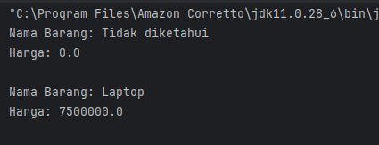

---

### 2.5.2 Latihan

1. Buat class Barang dengan atribut namaBarang dan harga.
2. Buat default constructor dan parameterized constructor.
3. Buat object dari class Barang menggunakan kedua constructor tersebut.

**Program:**

`Barang.java`

```java
package Praktikum_2.bagian_5.Latihan;

public class Barang {
    String namaBarang;
    double harga;

    // Default Constructor
    public Barang() {
        namaBarang = "Tidak diketahui";
        harga = 0;
    }

    // Parameterized Constructor
    public Barang(String namaBarang, double harga) {
        this.namaBarang = namaBarang;
        this.harga = harga;
    }

    // Method untuk menampilkan info
    public void tampilkanInfo() {
        System.out.println("Nama Barang: " + namaBarang);
        System.out.println("Harga: " + harga);
        System.out.println();
    }
}


```

`Main.java`

```java
package Praktikum_2.bagian_5.Latihan;

public class Main {
    public static void main(String[] args){

        // Object dengan default constructor
        Barang barang1 = new Barang();

        // Object dengan parameterized constructor
        Barang barang2 = new Barang("Laptop", 7500000);

        // Menampilkan data
        barang1.tampilkanInfo();
        barang2.tampilkanInfo();
    }
}

```

**Output:**

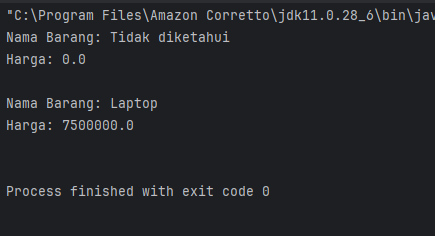

## 2.5 Bagian 6 — Sistem Manajemen Perpustakaan Sederhana

### 2.6.3 Langkah Praktikum

**Langkah Praktikum:**

1. Buat Sebuah package baru lagi didalam package modul_2 dengan cara klik kanan dan pilih New -> Package. Beri nama bagian_6
2. Kemudian buat sebuah class baru dengan nama Buku dan isikan kode dibawah ini:

`Buku`

```java
package Praktikum_2.bagian_6;

public class Buku {
    // Atribut (private)
    private String judul;
    private String pengarang;
    private int tahunTerbit;

    // Constructor (default)
    public Buku() {
        this.judul = "Unknown";
        this.pengarang = "Unknown";
        this.tahunTerbit = 0;
    }

    // Constructor (parameterized)
    public Buku(String judul, String pengarang, int tahunTerbit) {
        this.judul = judul;
        this.pengarang = pengarang;
        this.tahunTerbit = tahunTerbit;
    }

    // Setter dan Getter
    public void setJudul(String judul) {
        this.judul = judul;
    }

    public String getJudul() {
        return judul;
    }

    public void setPengarang(String pengarang) {
        this.pengarang = pengarang;
    }

    public String getPengarang() {
        return pengarang;
    }

    public void setTahunTerbit(int tahunTerbit) {
        this.tahunTerbit = tahunTerbit;
    }

    public int getTahunTerbit() {
        return tahunTerbit;
    }

    // Method untuk menampilkan informasi buku
    public void tampilkanInfo() {
        System.out.println("Judul: " + judul);
        System.out.println("Pengarang: " + pengarang);
        System.out.println("Tahun Terbit: " + tahunTerbit);
        System.out.println("------------------------------");
    }
}
```

3. Kemudian buat sebuah class baru dengan nama `Perpustakaan` dan isikan dengan kode di bawah ini.

`Perpustakaan.java`

```java


```

4. Yang terakhir buat sebuah class baru dengan nama `main` dan isikan kode dibawah ini.

`Main.java`

```java

package Praktikum_2.bagian_6;

import java.util.Scanner;

public class Main {
    public static void main(String[] args) {
        Scanner scanner = new Scanner(System.in);
        Perpustakaan perpustakaan = new Perpustakaan();
        int pilihan;

        do {
            // Menu
            System.out.println("\n=== Sistem Manajemen Perpustakaan ===");
            System.out.println("1. Tambah Buku");
            System.out.println("2. Tampilkan Semua Buku");
            System.out.println("3. Cari Buku");
            System.out.println("4. Keluar");
            System.out.print("Pilih menu: ");
            pilihan = scanner.nextInt();
            scanner.nextLine(); // Membersihkan newline

            switch (pilihan) {
                case 1:
                    // Tambah Buku
                    System.out.print("Masukkan judul buku: ");
                    String judul = scanner.nextLine();
                    System.out.print("Masukkan nama pengarang: ");
                    String pengarang = scanner.nextLine();
                    System.out.print("Masukkan tahun terbit: ");
                    int tahunTerbit = scanner.nextInt();
                    scanner.nextLine(); // Membersihkan newline

                    Buku bukuBaru = new Buku(judul, pengarang, tahunTerbit);
                    perpustakaan.tambahBuku(bukuBaru);
                    break;

                case 2:
                    // Tampilkan Semua Buku
                    perpustakaan.tampilkanSemuaBuku();
                    break;

                case 3:
                    // Cari Buku
                    System.out.print("Masukkan judul buku yang dicari: ");
                    String judulCari = scanner.nextLine();
                    perpustakaan.cariBuku(judulCari);
                    break;

                case 4:
                    // Keluar
                    System.out.println("Terima kasih telah menggunakan sistem ini!");
                    break;

                default:
                    System.out.println("Pilihan tidak valid. Silakan coba lagi.");
            }
        } while (pilihan != 4);

        scanner.close();
    }
}

```

**Output**

1. Menambahkan buku ke dalam perpustakaan dan menampilkan semua buku:

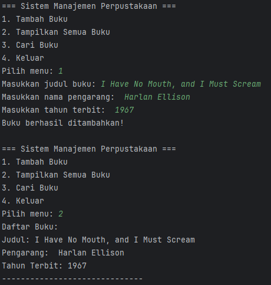

2. Mencari buku dan keluar dari program:

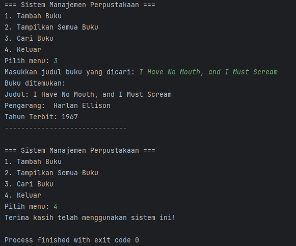